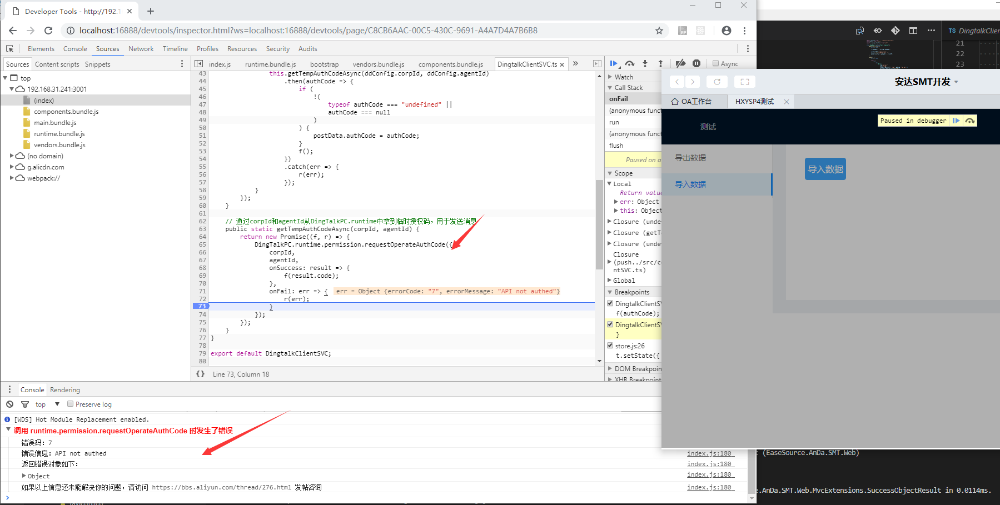

# DingTalkPCJSAPIIssue

## 问题描述

-   调用 DingTalkPC.runtime.permission.requestOperateAuthCode 会出现不能正常取到 authCode 的情况，错误码：7，错误信息：API not authed。
    

## 基础环境准备

-   安装以下软件：

1. .NET Core 2.1 SDK (https://www.microsoft.com/net/download/windows)
2. Node.js (https://nodejs.org/en/)
3. Windows 4.0 RC 版下载 (https://open-doc.dingtalk.com/docs/doc.htm?spm=a219a.7629140.0.0.3b2c4a97Ip2RH8&treeId=176&articleId=104958&docType=1)

-   在钉钉后台创建一个测试企业，自建测试应用，然后配置 src/web 目录下的 appsettings 文件。
    

*   安装好基础环境准备中的相关组件后，编译和运行两个服务：

1. src/Web 为后台 API 服务，执行 dotnet restore 之后，使用 dotnet run 运行；
2. src/UI/Dingtalk/PC 为前端 PC HTML5 页面，先执行 npm i，再执行 npm run build 之后，然后使用 npm run start 运行。

## 重现步骤

-   从钉钉工作台进入测试应用，看到如下界面：
    

-   直接点击"导入数据"按钮，可以正常获取 authCode；
    

-   切换到导出数据界面，点击"导出数据"按钮，会跳转到下图显示的界面，然后点击 OA 工作台返回主界面，再次进入测试应用；
    

-   点击“导入数据”按钮，则会出现不能正常取到 authCode 情况；
    

-   备注：导出数据界面中用到了 window.location，如果把这句删除，则不会出现上述问题。

```
   window.location = webApiUrl + printAPI;
```
